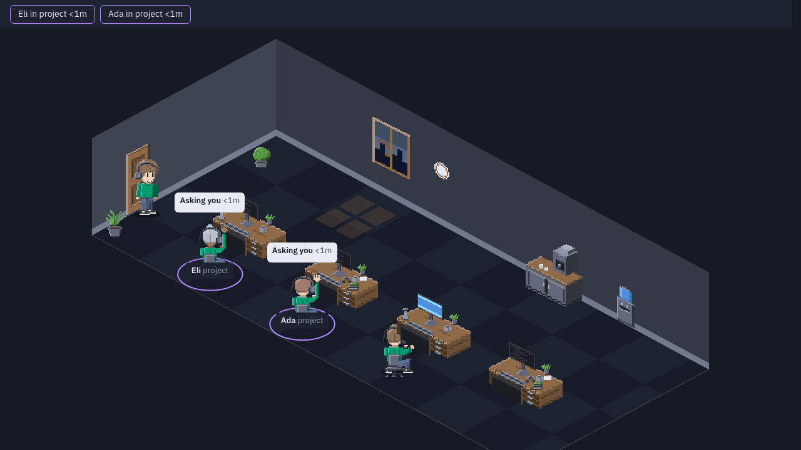

# Office Agents

A local web app that shows your running Claude Code agents and subagents as people in an isometric office.



> **Status: early development.** The live office works in `vp dev`: the feed, the scene and the top bar are built. Some of the behavior below is still planned; progress is tracked in the roadmap.

Run it with `vp dev` and open the page. Every recently active Claude Code session appears as a character sitting at a computer (only macOS is exercised at first). Each session wears its own shirt color (its subagents wear their parent's), and each gets a generated name and gender that stay the same across reloads.

- **Working:** the character types at the desk, and the screen shows scrolling lines. A waiting agent's screen stays half lit; every other screen is dark.
- **Subagents:** they walk in, take a sheet of paper from the parent's desk (it fades when the work is done), then sit at an empty desk and work on their own laptop or tablet. When done they hand the paper back and walk out.
- **Waiting for subagents:** the character stays at the desk and takes short, random drink breaks, to the coffee machine or the water dispenser. The schedule is the same after a reload.
- **Needs you:** the character waves and a speech bubble appears. A chip in the top bar, a tab title count `(N)` and a dot on the tab icon show who is waiting. By default this is a heuristic (the last message ends with a question mark, or a tool call has no result for a while), so it can wave falsely or miss a request. The optional hooks adapter makes it exact; see "Exact attention signals (optional hooks)" below. The speaker button at the right of the top bar turns on an optional chime (off by default): a soft two-note tone when an agent starts waiting, at most once every 5 seconds, silent for waits that began before the page loaded. Browsers allow sound only after a click, so a stored "on" reads "Chime: click" until the first click unlocks audio.
- **Done:** a subagent walks out when its result returns. A top-level agent stays at its desk, idle, and walks out after a quiet period.

The room itself is alive too. Four desks per row, in two alternating layouts (tidy and cluttered); a row is added when subagents need desks (up to 24 desks) and goes about a minute after the demand drops, with the whole room easing to its new size. The wall clock shows the real local time. Windows on the back walls show a night, dusk, overcast, rain, snow or late-afternoon view that follows the local hour, with a patch of light on the floor. The left wall also gets a bookshelf (from two rows) and two pictures (from three rows), in a palette that changes with the local date, and the door stands ajar, with a two-tone fan light, while a subagent walks in or out. All of it is decoration: it never changes an agent's state, and with reduced motion it stands still.

**What each banner means** (middle of the top bar):

- **Connecting...:** the page is waiting for the first data from the feed.
- **No active Claude Code sessions:** the feed works, but no session has been active recently. The desks stay empty.
- **Reconnecting...:** the connection dropped. The last scene stays on screen unchanged while the page retries.
- **Refused: open this page from localhost:** the feed answered 403. It checks every request's Host header and remote address and serves only loopback ones, so a page opened through a LAN address, another hostname, or from another machine is refused. A request carrying a `Forwarded`, `X-Forwarded-*` or `X-Real-IP` header (a proxy in front) is refused too. Open the page at `http://localhost:<port>` on the machine that runs `vp dev`.
- **Feed unavailable, retrying:** the feed is not answering. This shows on a built page (`vp build`) that has no feed, when the feed plugin failed to load (404 on `/__office/events`), or when the feed refuses with 503 (too many clients). The page retries on a timer.
- **Display error: reload the page:** the scene hit an error while drawing. The top bar stays up. The details are in the browser console. Reload the page.

Where to look: the `vp dev` terminal prints a feed log line, and `GET /__office/status` returns the feed state as JSON. Bad or invalid feed events are skipped and counted, with one dev warning per kind in the browser console. The feed tracks at most 5000 transcript files at once; past that, new files are ignored while tracked ones keep working.

The feed reads the transcripts Claude Code already writes in `~/.claude/projects`. Those can contain file contents and secrets, so the feed runs inside the Vite dev server and is meant to refuse any request when the dev server is not bound to localhost (for example with `vp dev --host`).

Design and review notes: [docs/designs/office-agents-isometric-office.md](docs/designs/office-agents-isometric-office.md); office-life plan: [docs/designs/office-life-ceo-review.md](docs/designs/office-life-ceo-review.md). Visual rules: [DESIGN.md](DESIGN.md). Build order: [BUILD_TODO.md](BUILD_TODO.md). Phase 0 art check: [docs/designs/phase-0-sprite-notes.md](docs/designs/phase-0-sprite-notes.md). Third-party notices: [NOTICE](NOTICE). Deferred ideas: [TODOS.md](TODOS.md).

## Roadmap

- [x] Design doc, engineering review and design review
- [x] Check CC0 sprite packs for poses and a clean shirt color band (none fit; characters and props will be drawn)
- [x] Draw characters and props as isometric pixel sprites (BUILD_TODO 4.0)
- [x] Recolor shirts with a CSS variable, one color per session (BUILD_TODO 4.3)
- [x] Event types and transcript normalizer
- [x] Feed plugin: tail transcripts, stream to the browser, refuse non-localhost hosts
- [x] State machine and seeded identity (name, gender, project color)
- [x] Office scene: desks, characters, top bar, status banner
- [x] Subagent walk-in and paper handoff
- [x] Wave, speech bubble and tab title count
- [x] Reduced motion, keyboard and screen reader support
- [x] Office life: wall clock, hour-matched windows and floor light, two desk kinds, working screens, desk paper, subagent laptops and tablets, drink breaks (coffee and water dispenser), door ajar for subagents, bookshelf and pictures, rows that grow to 24 desks, debug hooks
- [x] End-to-end test with fixture transcripts (Playwright, `vp run e2e`)
- [x] Release checks: success criteria, frame budget and README picture (`vp run criteria`, `vp run perf`, `vp run hero`)
- [x] Opt-in attention chime: speaker button in the top bar, off by default (not yet checked in a real browser or design-reviewed; see TODOS.md)
- [x] Hooks adapter for exact attention signals, optional and installed only on request (BUILD_TODO Phase 7); which Notification types fire is still unverified

The release checks live in `e2e/release.ts`. `vp run criteria` runs the success criteria and prints PASS, FAIL or SKIPPED for each. `vp run perf` measures frame times at 12 and 24 agents and the style cost of a row change in headless Chrome (median of six repeats; a median above 16 ms and up to 17.5 ms is reported as INCONCLUSIVE and does not fail the run). `node e2e/release.ts perf --ab` repeats the row-change check with animations switched off and prints the difference; `node e2e/release.ts perf --strict` exits with code 3 when nothing failed but a verdict is INCONCLUSIVE (without it that is exit 0). Each perf repeat has a 2 minute deadline and the whole run 30 minutes; a hung repeat fails with a line naming the limit. `perf` rejects unknown or repeated arguments. `vp run hero` redraws `docs/hero.png`. `perf` and `hero` use a temporary feed root and never read your real `~/.claude/projects`. Criterion 1 of `criteria` is the exception: its live smoke reads your real `~/.claude/projects` (local only, over loopback), and prints only counts and timings, never transcript text.

### Roadmap rules

- Tick a checkbox when the work is done.
- Add a new checkbox when we get a new idea.

## Exact attention signals (optional hooks)

By default the office guesses who is waiting from the transcripts. Claude Code hooks can tell it exactly (permission prompts, real subagent start and stop). This is optional, and nothing is installed automatically.

```sh
node hooks/install.mjs            # print the hooks snippet, write nothing
node hooks/install.mjs --apply    # merge into ~/.claude/settings.json (timestamped backup first)
node hooks/install.mjs --remove   # remove only this checkout's entries (backup first)
```

Add `--settings <path>` to use another settings file and `--dry-run` with `--apply` or `--remove` to preview the result. The installer keeps your other keys and hooks, is safe to run twice, and refuses to touch a file that is not valid JSON. `--remove` only removes entries that point at this checkout's `office-hook.mjs`, so another checkout's entry stays.

The installed hook command runs `hooks/office-hook.mjs` from this repository checkout (the installer prints the path), so moving or deleting the checkout disables it, and a changed script runs on every hook event.

Privacy: `hooks/office-hook.mjs` sends only these fields: `hook_event_name`, `session_id`, `agent_id`, `agent_type`, `notification_type`, `tool_use_id`, `cwd` and `transcript_path` (no timestamp) to the dev server on loopback (`127.0.0.1`, or `::1` when the dev server is bound there; the address comes from `hook.json`), with a token from `~/.office-agents/hook.json`. It never sends messages, prompts, tool input or transcript contents. It always exits 0 with empty output within about 0.4 s and does nothing when the dev server is not running. A hook payload over 256 KB is dropped, not truncated, so that event is simply not reported.

Which Notification types fire for a permission prompt or an agent question is unverified; the mapping lives in `server/hooks-adapter.ts`. Check `/hooks` in Claude Code to confirm the hooks are active. To verify, run `vp dev` and trigger a permission prompt: the office tab should show that agent waiting. To uninstall, run `node hooks/install.mjs --remove`.

## Development

This project uses [Vite+](https://viteplus.dev/guide/); install its global `vp` CLI first. Then run `vp install` and `vp dev`. Run `vp check` before committing. `vp test` runs the Vitest suite. In dev only, open `/?art` to see the character and prop style sheet (poses, desk, appearance variants, a 12-agent row at 50%); the sheet is not part of the production build. Open `/?demo` to watch a scripted tour without real sessions (arrivals, work, a wave, a subagent trip, an idle coffee break); `/?demo=12` and `/?demo=24` show a crowded room. The demo feed is dev only and is not part of the production build. Also dev only: `?scene=<id>` pins every window to one scene (dusk, night, rain, snow, overcast, afternoon), `?hour=<0-23>` forces the hour the window scene is chosen for, and `?seed=<text>` salts its weather variant, and `?decor=<0-2>` pins the bookshelf and picture palette. The scene exposes its state as `data-*` attributes for tests and bug reports (`data-rows`, `data-desks`, `data-desk-kind`, `data-screen`, `data-device`, `data-break`, `data-drink`, `data-window-scene`, `data-door`); see DESIGN.md, "Debug hooks".

End-to-end tests use Playwright and live in `e2e/`. Install the browser once with `npx playwright install chromium`, then run `vp run e2e`. Each scenario (core, live, twelve, stale, empty, visual) starts its own `vp dev` on ports 5201 to 5206 (`--strictPort`, so free those ports first) with a temporary transcript folder generated at run time, so the tests never read your real `~/.claude/projects` and do not disturb a dev server on port 5173. The feed folder and build cache come from the `OFFICE_E2E_ROOT` and `OFFICE_E2E_CACHE` environment variables, which only the test harness sets; hook discovery (`hook.json`) uses a per-run temp dir through `OFFICE_HOOK_DIR`, so the real `~/.office-agents` is never written. `vp test` skips the `e2e/*.spec.ts` browser specs and runs the helper tests. The GitHub Actions workflow (`.github/workflows/ci.yml`) runs `vp check`, `vp test` and the E2E suite on every push and pull request; the `@visual` screenshot case is skipped in CI until the Linux baseline from the manual `update-baselines` job is committed to `e2e/__screenshots__`.
